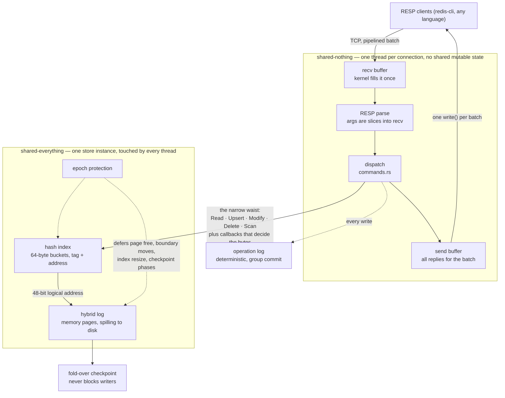

# mini-garnet-rs

[](https://github.com/SamuelXing/mini-garnet/actions/workflows/ci.yml)

A small, readable Rust reimplementation of the **core design** of
[Microsoft Garnet](https://github.com/microsoft/garnet) and its storage engine
**Tsavorite**, built to understand the ideas in the VLDB 2026 paper
*"Garnet: A Next-Generation Cache-Store for Accelerating Applications and
Services"* (Chandramouli et al., PVLDB 19(2), [PDF](https://www.vldb.org/pvldb/vol19/p224-chandramouli.pdf)).

This is a teaching model, not a product. It speaks enough of the RESP wire
protocol to be driven by a normal Redis client, and it implements the four
mechanisms the paper is actually about:

1. a **narrow-waist storage interface** (RUMDS: Read, Upsert, Modify, Delete, Scan),
2. a **hybrid log** that spans memory and disk (larger-than-memory, memory-optimized),
3. **epoch protection** as the basis for non-blocking control-plane operations, and
4. **tunable durability**: an operation log plus non-blocking checkpoints.

It deliberately leaves out cluster mode, the object store, the read cache,
revivification, kernel-bypass networking, TLS, Lua, and most of the 250+ command
surface. Those are large and orthogonal to the core.

```sh
cargo run --release -- --port 6399 --persist --aof
redis-cli -p 6399 set hello world
redis-cli -p 6399 incr counter
```

## Where to read next

- [docs/design-derivation.md](docs/design-derivation.md) — why the system looks
  like this. Why a hash index over a log, why the tail is mutable, why there are
  two read-only watermarks, why five operations and not fifty, and how it compares
  to Redis.
- [docs/storage-format.md](docs/storage-format.md) — the on-log record layout, the
  hash bucket, and the four regions of the address space.


## Architecture



The boundary in the middle is the design. Everything above it is per-connection
and shares nothing, so it needs no synchronization. Everything below it is shared
by every thread, and all the concurrency work is paid there, once. Garnet's phrase
is "shared-nothing sessions over a shared-everything store".

## Storage format

The log is where the interesting decisions live. How a key becomes a 48-bit
address, what a record looks like, and what the four regions of the log mean for
each operation are all in [docs/storage-format.md](docs/storage-format.md).

Short version: a cache-line-sized hash bucket holds seven `(tag, address)` entries
plus a latch, the address roots a chain of records whose links run downward through
one 48-bit space that spans memory and disk, and every operation branches on which
region of that space the record landed in.


## Compared to Redis

Short version: Redis optimizes for the simplicity of one thread; Garnet pays for
concurrency once, inside a storage engine, and spends the proceeds on throughput,
tail latency, tiering to disk, and checkpoints that do not stall. The long version,
with the paper's measurements and what Redis still does better, is in
[docs/design-derivation.md](docs/design-derivation.md#compared-to-redis).


## Code map

```
crates/
  tsavorite/            the storage engine, knows nothing about RESP
    epoch.rs            epoch protection and deferred reclamation
    record.rs           record header bits, on-log record layout
    index.rs            64-byte buckets, tentative-insert protocol, latches
    log.rs              circular page buffer, the address watermarks, flush/evict
    device.rs           the disk tier (file or in-memory)
    store.rs            the five operations, region decision, RCU, sealing, txn locks
    checkpoint.rs       fold-over checkpoint and recovery
    hash.rs             64-bit key hash
  garnet/               the cache-store on top of it
    resp.rs             incremental zero-copy parser and reply writer
    functions.rs        RESP string type as RUMDS callbacks — the "user logic"
    commands.rs         dispatch: many commands onto five operations
    aof.rs              the deterministic operation log
    shared.rs           process-wide state, recovery orchestration
    server.rs           accept loop, batch parse, one flush per batch
    main.rs             entry point
```

Every file opens with a comment naming the Garnet or Tsavorite mechanism it
mirrors and where it cuts a corner. Where the mini version deviates, the comment
says so rather than pretending.

## Running it

```sh
cargo test                                  # 38 tests
cargo run --release -- --port 6399
```

| flag | effect |
|---|---|
| `--port N`, `--bind ADDR` | listen address, default `127.0.0.1:6379` |
| `--dir PATH` | data directory for the disk tier, AOF and checkpoints |
| `--persist` | back the log with a real file; enables SAVE and tiering |
| `--aof` | log every write to the operation log |
| `--aof-commit-wait` | fsync before acknowledging each write |

Durability is tunable the way the paper describes. No flags gives a pure in-memory
cache. `--aof` gives lazy group-commit durability. `--aof-commit-wait` gives
commit-before-ack. `SAVE` takes a fold-over checkpoint and truncates the operation
log up to the point the checkpoint provably covers; on restart the server loads the
checkpoint and replays whatever is left.

Commands: `GET SET SETNX SETEX PSETEX GETSET GETDEL GETEX APPEND STRLEN GETRANGE
SUBSTR SETRANGE INCR DECR INCRBY DECRBY MSET MGET DEL UNLINK EXISTS EXPIRE PEXPIRE
EXPIREAT PEXPIREAT TTL PTTL PERSIST TYPE KEYS SCAN DBSIZE FLUSHDB FLUSHALL MULTI
EXEC DISCARD WATCH UNWATCH PING ECHO SELECT HELLO COMMAND CONFIG CLIENT INFO RESET
QUIT SAVE BGSAVE BGREWRITEAOF LASTSAVE`. `SET` takes `EX PX EXAT PXAT NX XX GET
KEEPTTL`.

Expiration is lazy: an expired record reads as absent and is reclaimed by the next
write, using the timestamp carried in the operation rather than the wall clock, so
that replaying the log expires exactly the same keys.

## Not implemented, relative to real Garnet

The omissions are deliberate. Each of these is either large enough to be its own
project or orthogonal to the ideas the model is meant to show. Where the code has
a natural attachment point, the comment there says so.

**Storage engine**

- **Object store.** List, Hash, Set, SortedSet and Geo as heap objects held
  behind an 8-byte pointer in the log and serialized on eviction. This is the
  second half of the paper's storage story and the biggest single gap here.
- **Read cache.** A second in-memory log between the index and the main log, so
  hot records read from disk stay resident.
- **Revivification.** The binned free-list that hands deleted and expired record
  slots back to new writes instead of letting the log grow.
- **Log compaction.** Rewriting live records off the oldest pages to reclaim disk.
- **Snapshot and streaming checkpoints.** Only the fold-over variant is here. The
  separate-device snapshot and the replica-seeding streaming snapshot are not.
- **Index checkpointing.** Recovery rescans the log to rebuild the index, which
  is correct but slower than restoring a saved index.
- **Hash index resize.** The grow path and its BARRIER/RESIZE state machine.
- **Asynchronous pending IO.** Disk reads here are synchronous inside the
  operation rather than queued and completed on an IO thread.
- **Tiered devices.** One device only, so no SSD-plus-cloud write-through with a
  per-tier commit point.
- **ETags**, and the conditional commands built on them.

**Server**

- **Cluster mode.** Sharding into 16,384 slots, CRC16 routing, MOVED and ASK
  redirects, server-to-server slot migration, replication, gossip, failover.
  Roughly as much code again as everything in this repo.
- **Most of the command surface.** Strings, generic key commands, transactions
  and a few admin commands are implemented. The other ~190 RESP commands,
  including all the complex data types, are not.
- **Bitmaps and HyperLogLog.**
- **Pub/Sub.** `SUBSCRIBE` and friends are recognized only well enough to be
  rejected inside `MULTI`.
- **Lua, stored procedures, modules, custom object types.**
- **Multiple databases.** `SELECT` replies `+OK` and does nothing.
- **`CONFIG`, `INFO`, `CLIENT`, `COMMAND`** are stubs that reply with something
  well-formed and empty.
- **ACL and AUTH.**
- **Active expiration.** Expiry here is entirely lazy, so an untouched expired
  key holds its memory until something reads or writes it.
- **TLS, Unix sockets, kernel-bypass networking** (DPDK and RDMA via eRPC).
- **io_uring.** The paper's fast checkpoint depends on it; this uses ordinary
  blocking writes.

**Shortcuts taken for readability, not size**

- `MULTI` copies its queued command bytes. Garnet remembers the receive-buffer
  offset and re-parses the original bytes at `EXEC`, which avoids the copy but
  couples the transaction code to the network buffer's lifetime.
- Command parsing is a plain byte match. Garnet uses SIMD to compare a whole
  `*1\r\n$3\r\nGET\r\n` frame against precomputed vectors.
- The AOF takes one lock per write command. Garnet stages entries in per-session
  buffers and splices them under one lock per network batch.
- One thread per connection, rather than an IO completion port thread pool.

None of these change the design the model is illustrating.
