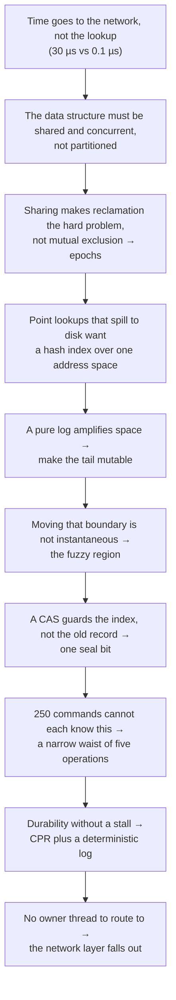
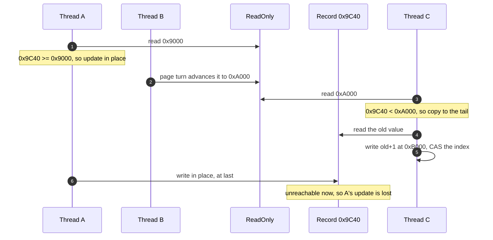

# Reading guide: the derivation, with the code beside it

[docs/design-derivation.md](design-derivation.md) argues *why* Garnet ends up
looking like this. This guide is the same chain of forced moves with the code
next to each one, anchored on a single command — `INCR counter` — so that every
abstract decision has a concrete cost you can point at.

The format is fixed. For each move: the problem the previous move left behind,
what breaks if you take the obvious route instead, the choice that is forced, and
the lines that implement it.

## The chain

Nothing here is a free choice. Each move is forced by the one above it.



## 1. Sharing, not partitioning

**The measurement.** A round trip costs tens of microseconds; the hash lookup
costs about 100 ns. Two levers matter: batch the round trip, and use every core.

**The obvious route, and what it costs `INCR counter`.** A global lock makes 72
threads contend for one cache line, so you spend 100 ns acquiring a lock to
protect a 100 ns operation, serially. Sharding by key means the connection thread
must enqueue the command to whichever thread owns `counter`, wait, and then
re-collate the batch's replies into FIFO order — and a hot key pins one core while
the rest idle. The paper measures 1.3 and 9 Mops/s against Garnet's 47.

**Forced.** One store instance, reachable from every thread. Partitioning moves
the request to the data; sharing lets cache coherence move the data to the
request, which is hardware you are already paying for.

**In the code.** [`server.rs:52`](../crates/garnet/src/server.rs#L52) — each
connection thread holds an `Arc<Shared>` and runs the whole batch itself. There is
no queue anywhere in this repo.

## 2. Epoch protection

**The problem left behind.** Once every thread can reach every record, the hard
part is not two threads writing the same record — a bucket latch settles that. It
is that a thread holding a raw pointer into a page can be racing another thread
that wants to free the page:

```rust
let rec = store.log.record_at(0x9C40);   // raw pointer
      // ← another thread decides this page is flushed and reuses it
let cur = parse_i64(rec.value());        // garbage
```

**The obvious route.** Reference counting costs two atomic RMWs on a shared line
per access — more than the lookup. Hazard pointers are thread-local to publish but
must be published on *every* access and scanned by the reclaimer.

**Forced.** Drop the precision. A thread does not announce *which* page it is
reading, only that it is *working at all*, in epoch `E`. One store into a
cache-line-padded slot that no other thread writes covers everything the operation
touches. Retirement is deferred, never blocked: the reclaimer records an intent
and moves on.

**In the code.** [`epoch.rs:133`](../crates/tsavorite/src/epoch.rs#L133) is the
entire fast path; [`epoch.rs:174`](../crates/tsavorite/src/epoch.rs#L174) computes
`min(protected) - 1`, and the `- 1` is load-bearing: a thread that published `E`
may still be looking at state retired *in* `E`.

**What `INCR` pays.** Two stores, in
[`store.rs:604`](../crates/tsavorite/src/store.rs#L604).

**Why this is the enabling primitive, not a detail.** Epochs answer a more general
question than reclamation: *I changed something global — how do I know everyone
has seen it?* The same three lines appear four times:

| Subsystem | Boundary published | Deferred consequence |
|---|---|---|
| Flush | `ReadOnly` | write pages to the device |
| Eviction | `Head` | free pages |
| Checkpoint | `(phase, version)` | capture the tail, flush |
| Index resize | new table pointer | free the old table |

[`log.rs:327`](../crates/tsavorite/src/log.rs#L327),
[`log.rs:393`](../crates/tsavorite/src/log.rs#L393) and
[`checkpoint.rs:102`](../crates/tsavorite/src/checkpoint.rs#L102) are the same
shape. The paper's "epoch-protected state machine" is not a second mechanism; it
is this one with the action replaced by "everybody has observed the new phase".

## 3. A hash index over one address space

**The problem left behind.** Larger than memory, but optimized for a working set
that fits.

**The obvious route.** A B-tree pays a traversal per read; an LSM pays bloom
filters, multi-level reads, and compaction's write amplification and latency
spikes. Both are buying range queries. RESP never scans a key range, so that is a
per-operation cost for a capability you never use.

**Forced.** A hash index whose values are 48-bit logical addresses into one
append-only space whose low end is on disk and high end is in a circular page
buffer.

The single address space is the whole trick. `counter → 0x9C40` means:

```rust
0x9C40 >= head_address   // in memory: dereference
0x9C40 <  head_address   // on disk: issue a read
```

**Evicting a page changes nothing in the index.** Compare a buffer pool, which
must find every reference to an evicted page and rewrite it — that requires a
reverse index and an atomic multi-write, and it is where buffer-pool complexity
comes from. Here it does not exist.

**In the code.** [`store.rs:520`](../crates/tsavorite/src/store.rs#L520) —
`trace_back(latest, key, head)`, where `head` is literally "memory stops here".

## 4. A mutable tail

**The problem left behind.** `INCR counter` a million times on a pure log writes a
million records, 999,999 of them garbage. LSMs answer with compaction and pay
write amplification for it.

**Forced.** Split the in-memory portion. Above `ReadOnly` records are updated in
place; below it they are frozen and an update becomes read-copy-update.

```
    ← cold ──────────────────────────────── hot →
disk │  immutable (memory)  │ReadOnly│    mutable    │ Tail
                                     └ change bytes ┘
```

One data structure behaves like an in-memory hash table for the working set and
like a log-structured store for everything else. This is the most consequential
decision in the engine.

**In the code.** [`store.rs:901`](../crates/tsavorite/src/store.rs#L901) is the
watershed:

```rust
if addr >= ro {
    match self.functions.in_place_updater(key, input, rec, out) {
        InPlaceResult::Updated  => return Op::Done(Status::InPlaceUpdated),
        InPlaceResult::NeedCopy => {}
    }
    return self.rmw_copy(...);
}
```

**What `INCR` does here.** [`functions.rs:325`](../crates/garnet/src/functions.rs#L325)
parses the digits, adds, and writes back — unless the answer needs more digits
than `value_cap`. A fresh `INCR` allocates exactly `i64_digit_len(delta)` bytes, so
a counter updates in place from 1 to 9 and copies once at 10: **one RCU per order
of magnitude**, no garbage in between.

## 5. The fuzzy region

This is the piece that looks arbitrary until you see the race it prevents.

`ReadOnly` has to keep moving — pages are recycled, so what was mutable must
freeze, flush, and be evicted. But *moving it is not instantaneous*, and two
threads can straddle the move while operating on the same record:



Neither thread did anything wrong. They read *different versions of the same
boundary*. This is not a data race; it is a boundary that is mid-flight.

**Forced.** Name both ends of the handshake. `ReadOnly` is what one thread
published; `SafeReadOnly` is what everyone has since observed, set only after the
epoch drains. The gap between them is the fuzzy region.

| Record lies in | Read | Update |
|---|---|---|
| `>= ReadOnly` | fine | in place |
| `[SafeReadOnly, ReadOnly)` | fine | **retry later** |
| `< SafeReadOnly` | fine | copy to the tail |

Reads are fine because the worst case is the value from just before or just after
someone's in-place write — both are values that legitimately existed. An update
would swallow someone else's. The engine cannot tell whether anyone is writing in
there, so it declines to guess.

**In the code.** [`store.rs:923`](../crates/tsavorite/src/store.rs#L923), and the
handshake that produces `SafeReadOnly` at
[`log.rs:327`](../crates/tsavorite/src/log.rs#L327):

```rust
self.read_only_address.compare_exchange(cur, new_ro, ..);   // publish, optimistic
self.epoch.bump_with_action(move || {
    me.safe_read_only_address.fetch_max(new_ro);            // after the drain
    me.flush_until(new_ro);                                 // only now safe to write
});
```

The flush waits for the same reason: writing a page while someone is still
updating it in place produces a torn record. `Head`/`SafeHead` is the identical
pair for eviction.

## 6. One seal bit

**The race a CAS does not cover.** Thread A copies `0x9C40` to the tail and CASes
the index; thread B updates `0x9C40` in place. Both succeed, and B's write lands on
a record nobody can reach. The CAS protected the *index entry*; B never touched it.

**Forced.** After the CAS succeeds, seal the old record. Anyone who later finds a
sealed record retries instead of trusting it.

**In the code.** [`store.rs:984`](../crates/tsavorite/src/store.rs#L984) ends with
`old.info().try_seal()`, and
[`store.rs:644`](../crates/tsavorite/src/store.rs#L644) turns `is_closed()` into
`RetryLater`. The cost is one bit in a `u64` header word the operation had already
loaded.

**Where the latch lives, and why it gives up.** Reading and writing record
*contents* does need mutual exclusion, and the latch sits in the hash bucket's
eighth entry — the cache line the lookup already pulled in, so locking costs no
additional miss ([`index.rs:362`](../crates/tsavorite/src/index.rs#L362)). It is
try-only with bounded spinning: failure becomes `RetryLater`, which refreshes the
epoch. That rule ties this move back to move 2 — a thread spinning on a latch while
holding an epoch stalls reclamation for the whole process, including the work it is
itself waiting on.

## 7. The narrow waist

**The problem left behind.** The engine now has four log regions, sealing, epochs,
retries and version gates. No command author should have to know any of it. But a
fat generic interface — `get(key) -> Vec<u8>`, `put(key, val)` — throws away
in-place update, because the engine cannot tell that "add one" fits where the old
value sat.

**Forced.** Five operations plus callbacks. **The store decides where an operation
happens; the command decides what the bytes become.**

`INCR` implements four callbacks and never learns which region it ran in:

| Callback | What `IncrBy` does |
|---|---|
| `in_place_updater` | parse, add, write back; `NeedCopy` if the digits grew |
| `copy_updater` | write old + delta into a fresh allocation |
| `initial_updater` | key absent: write the delta |
| `need_copy_update` | veto on a non-integer or an overflow |

The `need_*` callbacks exist so a command can veto *before* space is allocated, and
for some commands they are the entire implementation:

```rust
SETNX  =  need_copy_update    → Cancel     // exists: do not overwrite
SETXX  =  need_initial_update → false      // absent: do not create
```

Zero lines of storage code. See
[`functions.rs:258`](../crates/garnet/src/functions.rs#L258) and
[`functions.rs:432`](../crates/garnet/src/functions.rs#L432).

**The failure mode this shape invites.** A command's semantics are spelled out once
per region, so it is possible to guard the in-place path and forget the copy path —
and then the command's answer depends on how much unrelated traffic has passed
since the key was written. `INCR` had exactly that bug; the regression test in
`tests/integration.rs` walks one key set through all three regions.

## 8. Durability without a stall

**Checkpoints.** Traditional consistency requires quiescing; Redis forks, which can
double the footprint. CPR instead drives the store from version `v` to `v + 1`
through the epoch state machine
([`checkpoint.rs:102`](../crates/tsavorite/src/checkpoint.rs#L102)). One rule does
the work: **a `v + 1` thread may not update a `v` record in place.** Everything of
version `v` below the captured tail is then a consistent prefix, and flushing it
blocks nobody. For `INCR`, that rule is
[`store.rs:659`](../crates/tsavorite/src/store.rs#L659) — the command silently takes
the copy path and leaves the `v` value intact for the checkpoint.

**The operation log.** Log at the narrow waist rather than at the wire, and capture
all non-determinism into the logged input. Concretely that is one line,
[`commands.rs:121`](../crates/garnet/src/commands.rs#L121): the clock is read once
per command and then never again, so replay re-runs the command with the logged
timestamp and the same records expire. Without it, `SET k v EX 10` followed by
`INCR k` recovers differently depending on how long the replay took to reach the
second command. Because replay is deterministic, the same log is also the
replication stream.

## 9. The network layer falls out

The causality runs one way only: the store is shared and thread-safe → there is no
owner thread for a key → there is nothing to route to → the buffer the kernel
filled is parsed, executed and answered on the thread that received it. No queue,
no handoff, no collation, and the session's working set stays in L1/L2.

This is also why Garnet, unlike Redis, has no I/O-thread versus worker-thread
split. Redis separates them because execution *must* be serialized, so the
parallelizable part is worth peeling off. Here every thread does both, because a
handoff would buy nothing and cost a cross-core cache-line migration.

Add RESP's FIFO sessions and client-side pipelining and you get one `read` syscall
in and one `write` syscall out for hundreds of operations
([`server.rs:83-150`](../crates/garnet/src/server.rs#L83-L150)).

**Where this model differs from Garnet.** One thread per connection is the shortest
implementation of "no thread hop", not the property itself. It ties the thread count
to the connection count, and threads own epoch-table slots, so this server caps
connections at `--maxclients` (120 by default) and refuses past it. A production
design keeps the property with a thread pool sized by cores over non-blocking I/O;
the reason this model does not is that `find_on_disk` is a synchronous read, which
thread-per-connection tolerates and a worker pool would not.

## The life of one command

The same walk, annotated with which move each step is cashing in.

| # | Step | Code | Move |
|---|---|---|---|
| 1 | one `read()` collects a batch | [server.rs:102](../crates/garnet/src/server.rs#L102) | 9 |
| 2 | parsed on the receiving thread | [server.rs:117](../crates/garnet/src/server.rs#L117) | 9 |
| 3 | args are offsets into the receive buffer | [resp.rs:60](../crates/garnet/src/resp.rs#L60) | 9 |
| 4 | `now_ms` pinned once | [commands.rs:121](../crates/garnet/src/commands.rs#L121) | 8 |
| 5 | becomes `StringInput { IncrBy, delta: 1 }` | [commands.rs:461](../crates/garnet/src/commands.rs#L461) | 7 |
| 6 | `protect()`: one local store | [store.rs:604](../crates/tsavorite/src/store.rs#L604) | 2 |
| 7 | hash splits into bucket and tag | [index.rs:297](../crates/tsavorite/src/index.rs#L297) | 3 |
| 8 | latch taken on the line already loaded | [index.rs:362](../crates/tsavorite/src/index.rs#L362) | 6 |
| 9 | latch failure → refresh the epoch | [store.rs:663](../crates/tsavorite/src/store.rs#L663) | 2 + 6 |
| 10 | walk the chain, floor at `head` | [store.rs:520](../crates/tsavorite/src/store.rs#L520) | 3 |
| 11 | `addr >= ReadOnly` → update in place | [store.rs:901](../crates/tsavorite/src/store.rs#L901) | 4 |
| 12 | `addr >= SafeReadOnly` → retry later | [store.rs:923](../crates/tsavorite/src/store.rs#L923) | 5 |
| 13 | a `v+1` thread meets a `v` record → copy | [store.rs:659](../crates/tsavorite/src/store.rs#L659) | 8 |
| 14 | after the copy's CAS, seal the old record | [store.rs:984](../crates/tsavorite/src/store.rs#L984) | 6 |
| 15 | the callback decides the bytes | [functions.rs:325](../crates/garnet/src/functions.rs#L325) | 7 |
| 16 | `unprotect()`: pages may be reclaimed | [store.rs:604](../crates/tsavorite/src/store.rs#L604) | 2 |
| 17 | log the RESP bytes and `now_ms` | [commands.rs:88](../crates/garnet/src/commands.rs#L88) | 8 |
| 18 | one `write()` for the batch | [server.rs:146](../crates/garnet/src/server.rs#L146) | 9 |

Rows 11 through 14 are four branches of one `if` chain. Nine moves of derivation
condense into about thirty lines of `internal_rmw`.

## Three sentences

1. Sharing rather than partitioning is what buys the whole machine, and its real
   price is not locking but reclamation — which epochs settle for one store in and
   one store out.
2. A mutable tail makes one structure behave as an in-memory hash table for hot
   data and a log-structured store for cold data; the second read-only watermark
   is nothing more than the fact that moving the line between them takes time.
3. The narrow waist is what lets 250 commands reuse both: the store decides where,
   the command decides what — `INCR` never learns which region it ran in, and the
   engine never learns what `INCR` means.
