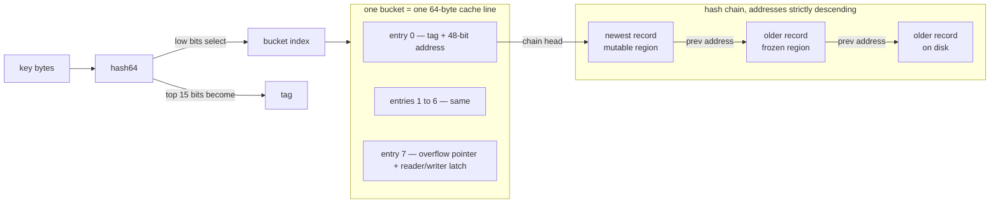
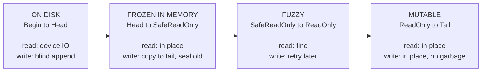
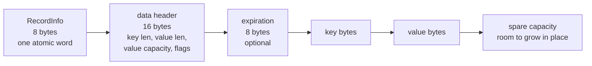

# The storage format

How a key becomes an address, what a record looks like on the log, and why the
log has more watermarks than you would expect. The reasoning behind these
choices is in [design-derivation.md](design-derivation.md).

The log is where the interesting decisions live, so it is worth going slowly.

## Finding a key

Two things fall out of this picture.

The latch shares a cache line with the entries, so taking it costs no extra cache
miss once you have done the lookup. That is why it lives in entry 7 next to the
overflow pointer instead of in the record.

The chain crosses the memory/disk boundary without noticing. A previous-address
field is just a number in one 48-bit space. Whether following it is a pointer
dereference or a disk read is decided by comparing it against `Head`, and nothing
is rewritten when a page is evicted.

## The address space and the region decision

Every operation does the same four things: hash the key, take the bucket latch
(shared to read, exclusive to write), walk the chain to the newest record for that
key, then branch entirely on **where that record's address falls**.

| record lives in | Read | Upsert | Modify (RMW) | Delete |
|---|---|---|---|---|
| mutable | read in place | overwrite in place | update in place | tombstone in place |
| fuzzy | read | blind insert at tail | **retry later** | copy tombstone to tail |
| frozen | read | new record at tail | copy to tail, seal old | copy tombstone to tail |
| on disk | read from device | blind insert | read it, then copy | read it, then tombstone |
| no record | not found | initial write | initial update | not found |

Upsert never reads from disk, because it is blind and does not need the old value.
That single row is why `SET` on a cold key costs no IO while `APPEND` on the same
key does.

The fuzzy column is the one that looks arbitrary. It is not: it is the width of
the epoch handshake, and [the derivation](design-derivation.md#the-fuzzy-region-is-the-epoch-handshake-made-visible)
walks through why it has to exist.

## What a record looks like

`RecordInfo` is a single 64-bit word so that all of a record's structural state
changes with one atomic store or CAS:

| bits | field | why it exists |
|---|---|---|
| 0-47 | previous address | the hash chain; one 48-bit space covering memory and disk |
| 48 | tombstone | logical delete |
| 49 | valid | cleared while a new record is being filled, and forever if its CAS loses |
| 50 | in new version | written after a checkpoint version bump (CPR) |
| 51 | modified | dirty since the last checkpoint |
| 52 | sealed | this record was copied to the tail; anyone who finds it must retry |

The spare capacity at the end is what makes in-place update possible for growing
values. `INCR` on `99` needs three digits where two were allocated; if the
capacity covers it the update stays in place, and if not the callback returns
false and the engine falls back to copy-to-tail. The command never learns which
happened.

Two independent write paths meet on this record and neither takes a lock on it.
Publishing a new record is one CAS on the hash entry, with the record itself
filled beforehand while marked invalid. Preventing the lost update that this
enables is the `sealed` bit, set on the old record after that CAS succeeds. That
is the whole concurrency story for record contents, in one word.
